<style>
  html {
    display: flex;
    justify-content: center;
  }
  body {
    width: 100vw;
    max-width: 700px;
    background-color: #EEE;
    color: #4d4d4d;
  }
  img {
    width: 80%;
    margin-left: 5%;
    outline: solid #4d4d4d;
  }
  h2 {
    counter-reset: section;

    margin-top: 30px;
    padding-left: 10px;
    border-left: 0.1em solid #4d4d4d;
  }
  h3 {
    font-weight: bold;
  }
  h3::before {
    counter-increment: section;
    content: "（" counter(section) "） ";
  }
  h4 {
    font-size: 1em;
    padding-left: 0.6em;
  }
  h4::before {
    content: "> ";
  }
  p {
    padding-left: 0.6em;
  }
</style>

# jig.jp サマーインターンシップ2024 選考課題

## はじめに

今回のインターンシップの選考課題では、「しりとりアプリ」を実装して提出していただきます。  
使用言語やフレームワークに制限はありませんので、得意な環境で取り組んでください。

## 課題内容

「しりとりアプリ」を実装して提出してください。詳細を以下に示します。

### 提出物

ソースコードと`README`を掲載したGitHubリポジトリのリンクを以下のGoogleフォームから提出してください。 
成果物のフォーマットは問いませんので、実行ファイルやデプロイされたWebアプリのURL等、動作が確認できるものを提出してください。また、確認用に特殊な環境が必要な場合は、事前に相談してください。

また、`README`には以下の内容を記述してください。

- 実装した機能やデザインの説明
- アプリの動作確認の方法（WebサイトのURLや、セットアップを含めたアプリケーションの実行手順等）
- 参考にしたWebサイト

**課題提出用Googleフォーム**  
[https://forms.gle/6qYWrwsMaz8v7yLf7](https://forms.gle/6qYWrwsMaz8v7yLf7)

### 仕様

最低限、以下の仕様を満たすように実装してください。

- 直前の単語を、表示できるようにする
- 任意の単語を、入力できるようにする
- 直前の単語の末尾と、入力した単語の先頭を比較して、同じ場合だけ単語を更新する。違う場合は、エラーを表示する
- 末尾が「ん」で終わる単語が入力されたら、ゲームを終了する
- 過去に使用した単語が入力されたら、ゲームを終了する
- ゲーム中や終了後に、最初からやり直せるリセット機能をつける

また、便利・面白いと思う任意の機能を考えて実装してください。実装する機能の個数は問いません。  
以下に例を示しますが、他に機能を思いついた場合は、自由に実装してみてください。

- 最初の単語がランダムに決まるようにする
- 一文字のものや絵文字等、しりとりとして不適切な単語は入力できないようにする
- ひらがな以外は入力できないようにする
- 実在しない単語は入力できないようにする
- しりとりの単語の履歴を表示できるようにする
- 複数のユーザーが対戦できるようにする

実装した内容は、`README`に記載してください。

### 実装環境

使用する言語やフレームワークの指定は、特にありません。得意なものや、気になっているものを使用して実装してください。  
特に環境に拘りの無い方は、以下にDenoを使用して途中まで実装した例を示しますので、Denoを使用して実装してみてください。

## Step 0. GitHubアカウントの作成

> GitHubアカウント作成後、数日経過しなければ使用できない機能もあるため、早めに登録することをおすすめします。

作成したWebアプリケーションの提出等に必要なため、GitHubアカウントを作成しましょう。  
以下のWebサイトからアカウント登録を行ってください。

> 既にアカウントをお持ちの方は、そちらのアカウントを使用していただいて構いません

[https://github.com/](https://github.com/)

## Step 1. Denoのインストール

### Deno (ディーノ) とは

Denoは、JavaScript/TypeScriptの実行環境(ランタイム)です。これらの言語でサーバーの処理を実装できます。  
ここでは、入門者向けとしてJavaScriptを使用します。TypeScriptの使用方法が分かる方は、そちらを使用していただいても問題ありません。

Webフロントエンドで多く用いられるJavaScriptを使用するため、フロントエンドとバックエンドを同一言語で実装できます。  
DenoはNode.jsの作者であるライアン・ダール氏によって実装されたランタイムで、Node.jsをブラッシュアップしたものとなっています。

> Denoという名前は、Nodeのアナグラムだそうですよ！

### Denoのインストール

公式サイトの説明に従い、Denoをインストールしてみましょう。

[https://docs.deno.com/runtime/manual](https://docs.deno.com/runtime/manual)

「Install Deno」の項目に記載されたコマンドをご自身のOSに合わせて実行するだけで、インストールが可能です。  
インストールが完了したら、以下のコマンドを実行してみましょう。バージョン情報が表示されればOKです！

```sh
# 入力
deno --version

# 出力
# deno 1.42.2 (release, aarch64-apple-darwin)
# v8 12.3.219.9
# typescript 5.4.3
```

### DenoでHello World

Hello Worldプログラムを作って実行してみましょう。  
空のフォルダを作り、中に `server.js` を作成して、以下のプログラムを書き込んでください。

```
console.log("Hello World!");
```

保存が完了したら、Denoで実行してみましょう！

```sh
deno run server.js

# Hello World!
```

## Step 2. Visual Studio Codeのインストール・セットアップ

### Visual Studio Codeとは

Microsoftが提供しているソースコードエディタです。VS Codeとも呼ばれます。  
開発に必要な機能の多くを搭載しており、プラグインの開発も企業・個人問わず行われているので、特に拘りが無ければインストールをおすすめします。

既にお気に入りのエディタがある場合は、インストールせずに進めていただいても構いません。

### Visual Studio Codeのインストール

公式サイトの説明に従い、Visual Studio Codeをインストールしてみましょう。

https://code.visualstudio.com/

ご自身のOSに合わせたものをダウンロードして、インストールしましょう。

### Denoの拡張機能をインストール

VS CodeにDenoの拡張機能をインストールしましょう。画面左側の「Extensions」アイコンから拡張機能の画面を開き、「Deno」で検索して、インストールしてください。

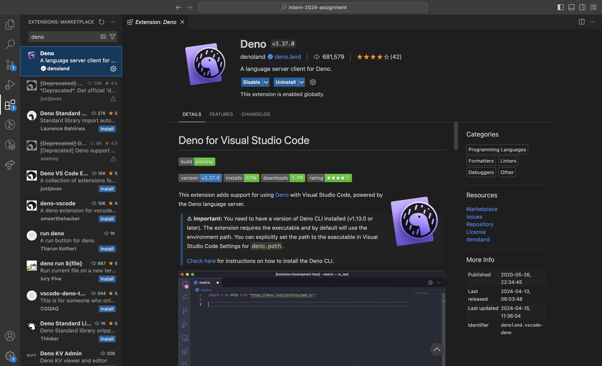

### Denoの拡張機能をセットアップ

`server.js`を作成したフォルダで、Denoの拡張機能の設定を行いましょう。「Control+Shift+P」でコマンドパレットを開き、「Deno: Initialize Workspace Configuration」を実行します。  
`.vscode/settings.json`が作成され、Deno関連の補完が効くようになったらOKです。


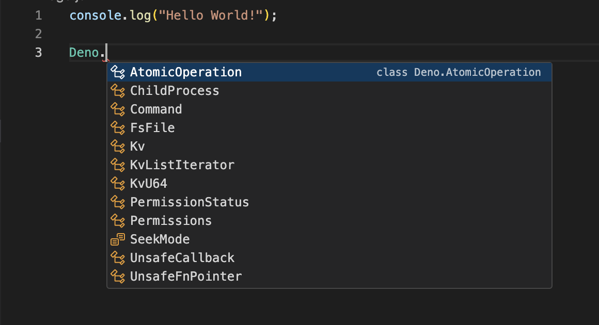


## Step 3. DenoでHTTPサーバーを立ててみよう

DenoでHTTPサーバーを立ち上げてみましょう。

HTTPサーバーとは、HTTP (HyperText Transfer Protocol) に則って通信するサーバーです。  
HTTPサーバー上に処理やデザイン等を記述することで、様々なWebアプリを動作させられます。  
Denoが提供している`serve`関数を利用することで、簡単にHTTPサーバーを立ち上げることができます。

以下に実装と作動の手順を示します。

1. `server.js`の内容を以下のように書き換えて保存してください。

```
// server.js

// localhostにDenoのHTTPサーバーを展開
Deno.serve(request => {
    return new Response("Hello Deno!");
});
```

2. `--allow-net`オプションをつけて`server.js`を起動してください。このオプションがない場合、Denoがネットワークにアクセスできません。

```sh
deno run --allow-net server.js
```

3. ブラウザで`http://localhost:8000`にアクセスしてみましょう。

4. ブラウザに`Hello Deno!`と表示されればOKです！


5. 動作が確認できたら、「Control+C」でプログラムを終了します。

## Step 4. サーバーに変数を定義してみよう

HTTPサーバー上にアクセス数をカウントする変数を追加して、アクセス数を確認してみましょう。

1. `server.js`ファイルを以下の内容で編集します。

```diff
  // server.js
+ // アクセス数を保持する変数をグローバル領域に定義
+ let count = 0;
+ 
  // localhostにDenoのHTTPサーバーを展開
  Deno.serve(request => {
-     return new Response("Hello Deno!");
+     count++;
+     return new Response(`Count: ${count}`);
  });
```

2. `--allow-net`に加えて、`--watch`オプションを追加して`server.js`を起動してください。このオプションを指定すると、Denoがファイルの変更を自動でサーバーに反映してくれます。

```sh
deno run --allow-net --watch server.js
```

3. ブラウザで`http://localhost:8000`にアクセスしてみましょう。

4. 何回かアクセスして、ブラウザにアクセス回数が表示されればOKです！尚、ブラウザが自動で`/favicon.ico`を取得しようとするため、カウントが2つずつカウントアップすることがあります。

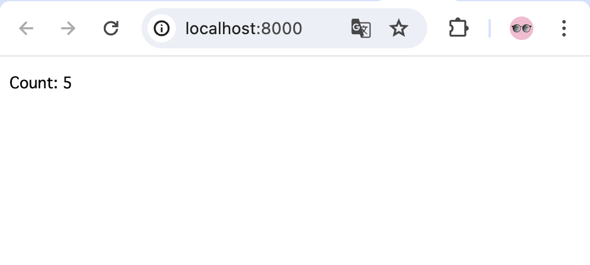

## Step 5. HTMLを表示してみよう

ブラウザにHTMLを表示させてみましょう。レスポンスに`h1`タグをつけ、ヘッダ情報を指定します。

今回はヘッダ情報の`Content-Type`に`text/html`を指定して、ブラウザにHTML形式のデータを返すことを通知します。`Content-Type`には様々なものがあり、例として以下のようなものが挙げられます。

| Content-Type | データ |
| -- | -- |
| text/html | HTML |
| text/css | CSS |
| text/javascript | JavaScript |
| application/json | JSON形式 |
| image/jpeg | 画像（JPEG）ファイル |
| image/png | 画像（PNG）ファイル |

1. `server.js`ファイルを以下の内容で編集します。

```diff
- // アクセス数を保持する変数をグローバル領域に定義
- let count = 0;
- 
  // localhostにDenoのHTTPサーバーを展開
  Deno.serve(request => {
-     count++;
-     return new Response(`Count: ${count}`);
+     return new Response(
+         // Responseの第一引数にレスポンスのbodyを設置
+         "<h1>H1見出しです</h1>",
+         // Responseの第二引数にヘッダ情報等の付加情報を設置
+         {
+             // レスポンスにヘッダ情報を付加
+             headers: {
+                 // text/html形式のデータで、文字コードはUTF-8であること
+                 "Content-Type": "text/html; charset=utf-8"
+             }
+         }
+     );
  });
```

2. ブラウザを再読み込みして、`H1見出しです`と大きく表示されればOKです！

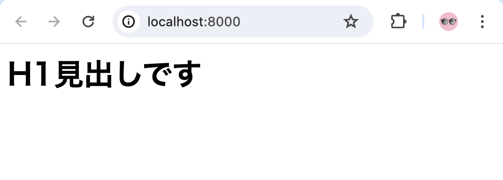

## Step 6. ファイルサーバーを実装してみよう

### HTMLファイルを読み込んでみよう

直前のセクションではHTMLを文字列としてスクリプト内に直に記述しましたが、別のファイルとして保存しておいたものを読み込むようにしてみましょう。

また、ファイルの読み込みが完了するまではレスポンスを返さないように、処理に`async-await`を追加します。JavaScriptでは非同期処理が採用されているため、`async-await`を記載しなければファイルがうまく表示できない場合があります。

> Topic: 「JavaScript 非同期処理」「JavaScript async await」などで調べてみましょう。

1. `public`フォルダを作成し、中に`index.html`を作成します。フォルダ構成は以下のようになります。

```
├─ .vscode/
├─ public/
│  └─ index.html
└─ server.js
```

2. `index.html`ファイルに以下の内容を記述します。

```
<!DOCTYPE html>
<html>

<!-- headタグの中にはメタデータ等を記載する -->
<head>
  <meta charset="utf-8">
</head>

<!-- bodyタグの中には実際に表示するものなどを書く -->
<body>
  <h1>H1見出しですよ</h1>
</body>

</html>
```

3. `server.js`ファイルを以下の内容で編集します。

```diff
  // localhostにDenoのHTTPサーバーを展開
- Deno.serve(request => {
+ Deno.serve(async (request) => {
+     const htmlText = await Deno.readTextFile("./public/index.html");
      return new Response(
          // Responseの第一引数にレスポンスのbodyを設置
-         "<h1>H1見出しです</h1>",
+         htmlText,
          // Responseの第二引数にヘッダ情報等の付加情報を設置
          {
              // レスポンスにヘッダ情報を付加
  ...
```

4. ブラウザを再読み込みして、`H1見出しですよ`と大きく表示されればOKです！


### CSSファイルを読み込んでみよう

CSSファイルを作成して、読み込めるようにしてみましょう。`index.html`とは別に`styles.css`を作成し、このファイルを読み込めるようにします。

1. `public`フォルダの中に、`styles.css`を作成します。

```
├─ .vscode/
├─ public/
│  ├─ index.html
│  └─ styles.css
└─ server.js
```

2. 各ファイルを、以下のように編集します。

```
/* public/styles.css */
body {
    background: skyblue;
}
```

```diff
  <!-- public/index.html -->
  ...
  <!-- headタグの中にはメタデータ等を記載する -->
  <head>
    <meta charset="utf-8">
+   <link rel="stylesheet" href="styles.css">
  </head>

  <!-- bodyタグの中には実際に表示するものなどを書く -->
  ...
```

```diff
  // server.js
  ...
  // localhostにDenoのHTTPサーバーを展開
  Deno.serve(async (request) => {
+     // パス名を取得する
+     // http://localhost:8000/hoge に接続した場合"/hoge"が取得できる
+     const pathname = new URL(request.url).pathname;
+     console.log(`pathname: ${pathname}`);
+ 
+     // http://localhost:8000/styles.css へのアクセス時、"./public/styles.css"を返す
+     if (pathname === "/styles.css") {
+         const cssText = await Deno.readTextFile("./public/styles.css");
+         return new Response(
+             cssText,
+             {
+                 headers: {
+                     // text/css形式のデータで、文字コードはUTF-8であること
+                     "Content-Type": "text/css; charset=utf-8"
+                 }
+             }
+         );
+     }
+ 
      const htmlText = await Deno.readTextFile("./public/index.html");
      return new Response(
          // Responseの第一引数にレスポンスのbodyを設置
  ...
```

3. ブラウザを再読み込みして、背景が青くなっていればOKです！


### publicフォルダ全体を公開してみよう

ページ数が増えた場合に、返すファイルを一つ一つ指定するのは手間がかかります。  
そこで、`public`以下を静的ファイルサーバーとして公開し、ここに入れたファイルは自動で公開されるようにしてみましょう。

1. `server.js`ファイルを以下の内容で編集します。

```diff
  // deno.landに公開されているモジュールをimport
  // denoではURLを直に記載してimportできます
+ import { serveDir } from "https://deno.land/std@0.223.0/http/file_server.ts";

  // localhostにDenoのHTTPサーバーを展開
  Deno.serve(async (request) => {
      // パス名を取得する
      // http://localhost:8000/hoge に接続した場合"/hoge"が取得できる
      const pathname = new URL(request.url).pathname;
      console.log(`pathname: ${pathname}`);
  
-     // http://localhost:8000/styles.css へのアクセス時、"./public/styles.css"を返す
-     if (pathname === "/styles.css") {
-         const cssText = await Deno.readTextFile("./public/styles.css");
-         return new Response(
-             cssText,
-             {
-                 headers: {
-                     // text/css形式のデータで、文字コードはUTF-8であること
-                     "Content-Type": "text/css; charset=utf-8"
-                 }
-             }
-         );
-     }
- 
-     const htmlText = await Deno.readTextFile("./public/index.html");
-     return new Response(
-         // Responseの第一引数にレスポンスのbodyを設置
-         htmlText,
-         // Responseの第二引数にヘッダ情報等の付加情報を設置
-             // レスポンスにヘッダ情報を付加
-             headers: {
-                 // text/html形式のデータで、文字コードはUTF-8であること
-                 "Content-Type": "text/html; charset=utf-8"
-             }
-     );
+     // ./public以下のファイルを公開
+     return serveDir(
+         request,
+         {
+             /*
+             - fsRoot: 公開するフォルダを指定
+             - urlRoot: フォルダを展開するURLを指定。今回はlocalhost:8000/に直に展開する
+             - enableCors: CORSの設定を付加するか
+             */
+             fsRoot: "./public/",
+             urlRoot: "",
+             enableCors: true,
+         }
+     );
  
  });
```

2. ブラウザを再読み込みして、先程と同じ内容が表示されればOKです！

## Step 7. ブラウザでJavaScriptを実行してみよう

ブラウザでJavaScriptを実行してみましょう。`alert`関数を使用して、ブラウザ上でアラートを出力します。

今回は簡単のため、HTMLファイルに直に処理を記述します。

1. `public/index.html`ファイルを以下の内容で編集します。

```diff
  <!-- bodyタグの中には実際に表示するものなどを書く -->
  <body>
    <h1>H1見出しですよ</h1>
+ 
+   <!-- JavaScriptを実行 -->
+   <script>
+     alert("Hello JavaScript!");
+   </script>
  </body>
  
  </html>
```

2. ブラウザを再読み込みして、アラートが表示されればOKです！


## Step 8. しりとりの実装: サーバーの処理を実装してみよう

ここからは、実際に「しりとり」をするWebアプリを実装します。
実装するアプリは、以下の仕様を満たしたものとします。

1. 直前の単語が表示できる。
2. 次の単語を入力できる。
3. 直前の単語の末尾と入力した単語の先頭が同一であれば、単語を更新。同一でなければ、エラーを表示する。

このセクションでは、サーバー側の処理を実装します。前セクションまでで実装した内容をベースにして実装を進めましょう。

### `GET /shiritori`を実装しよう

仕様1を満たすため、サーバーに保存されている直前の単語を取得できるようにしましょう。

`GET /shiritori`からデータを取得できるようにします。

1. `server.js`ファイルを以下の内容で編集します。

```diff
  ...
  import { serveDir } from "https://deno.land/std@0.223.0/http/file_server.ts";
  
+ // 直前の単語を保持しておく
+ let previousWord = "しりとり";
+ 
  // localhostにDenoのHTTPサーバーを展開
  Deno.serve(async (request) => {
      // パス名を取得する
      // http://localhost:8000/hoge に接続した場合"/hoge"が取得できる
      const pathname = new URL(request.url).pathname;
      console.log(`pathname: ${pathname}`);
  
+     // GET /shiritori: 直前の単語を返す
+     if (request.method === "GET" && pathname === "/shiritori") {
+         return new Response(previousWord);
+     }
+ 
      // ./public以下のファイルを公開
      return serveDir(
          request,
  ...	
```

2. ブラウザで`http://localhost:8000/shiritori`にアクセスして、「しりとり」と表示されればOKです！

### `POST /shiritori`を実装しよう

仕様2を満たすため、サーバーに保存されている単語を、受け取ったデータで更新できるようにしましょう。

`POST /shiritori`でデータを更新できるようにします。

1. `server.js`ファイルを以下の内容で編集します。

```diff
      // GET /shiritori: 直前の単語を返す
      if (request.method === "GET" && pathname === "/shiritori") {
          return new Response(previousWord);
      }
  
+     // POST /shiritori: 次の単語を入力する
+     if (request.method === "POST" && pathname === "/shiritori") {
+         // リクエストのペイロードを取得
+         const requestJson = await request.json();
+         // JSONの中からnextWordを取得
+         const nextWord = requestJson["nextWord"];
+ 
+         // previousWordの末尾とnextWordの先頭が同一か確認
+         if (previousWord.slice(-1) === nextWord.slice(0, 1)) {
+             // 同一であれば、previousWordを更新
+             previousWord = nextWord;
+         }
+ 
+         // 現在の単語を返す
+         return new Response(previousWord);
+     }
+ 
      // ./public以下のファイルを公開
      return serveDir(
          request,
```

2. `POST`のリクエストの送信は専用のツールやOSによって異なるコマンドが必要なので、動作確認はスキップして、次のセクションに進みましょう。もし動作確認の方法が分かるようであれば、動作確認してみてください。

## Step 9. しりとりの実装: Webの処理を実装してみよう

前セクションの内容を踏まえて、Web側の処理を実装しましょう。

### `GET /shiritori`の結果を表示する

`GET /shiritori`にアクセスして、直前の単語を取得します。以下のようにして実装してみましょう。

1. `public/index.html`ファイルを以下の内容で編集します。`fetch`を利用して`GET /shiritori`にリクエストを送信し、受信したデータを`p`タグに挿入します。

```diff
  ...
  <!-- bodyタグの中には実際に表示するものなどを書く -->
  <body>
-   <h1>H1見出しですよ</h1>
+   <h1>しりとり</h1>
+   <!-- 現在の単語を表示する場所 -->
+   <p id="previousWord"></p>
  
    <!-- JavaScriptを実行 -->
    <script>
-     alert("Hello JavaScript!");
+     window.onload = async (event) => {
+       // GET /shiritoriを実行
+       const response = await fetch("/shiritori", { method: "GET" });
+       // responseの中からレスポンスのテキストデータを取得
+       const previousWord = await response.text();
+       // id: previousWordのタグを取得
+       const paragraph = document.querySelector("#previousWord");
+       // 取得したタグの中身を書き換える
+       paragraph.innerHTML = `前の単語: ${previousWord}`;
+     }
    </script>
  </body>
...
```

2. ブラウザを`http://localhost:8000`で再読み込みして、「しりとり」と表示されればOKです！

> Topic: サーバー側の`previousWord`を書き換えて、反映されるか確認してみましょう。

### （起動時に）`POST /shiritori`に次の単語を送信してみよう

`POST /shiritori`にアクセスして、次の単語を入力してみましょう。ここでは、ブラウザの起動時に勝手に「りんご」と送信されるようにしてみます。

1. `public/index.html`ファイルを以下の内容で編集します。`GET`同様、`fetch`を使用して`POST /shiritori`にリクエストを送信します。

```diff
    <!-- JavaScriptを実行 -->
    <script>
      window.onload = async (event) => {
+       // 試しでPOST /shiritoriを実行してみる
+       // りんごと入力……
+       await fetch(
+         "/shiritori",
+         {
+           method: "POST",
+           headers: { "Content-Type": "application/json" },
+           body: JSON.stringify({ nextWord: "りんご" })
+         }
+       );
+ 
        // GET /shiritoriを実行
        const response = await fetch("/shiritori", { method: "GET" });
        // responseの中からレスポンスのテキストデータを取得
```

2. ブラウザを再読み込みして、「りんご」と表示されればOKです！

> Topic: サーバー側の`previousWord`やWeb側の`nextWord`を書き換えて、反映されるか確認してみましょう。しりとりとして単語が繋がっていなければ、更新されないようになっていることも確認しましょう。

### `POST /shiritori`に任意の単語を送信してみよう

起動時にサーバーの値を書き換えることができました。次に、任意の単語を送信できるようにしてみましょう。

1. `public/index.html`ファイルを以下の内容で編集します。送信ボタンが押下された時に`input`タグの中身を取得して、`POST /shiritori`に送信します。

```diff
   <h1>しりとり</h1>
    <!-- 現在の単語を表示する場所 -->
    <p id="previousWord"></p>
+   <!-- 次の文字を入力するフォーム -->
+   <input id="nextWordInput" type="text" />
+   <button id="nextWordSendButton">送信</button>
  
    <!-- JavaScriptを実行 -->
    <script>
      window.onload = async (event) => {
-       // 試しでPOST /shiritoriを実行してみる
-       // りんごと入力……
-       await fetch(
-         "/shiritori",
-         {
-           method: "POST",
-           headers: { "Content-Type": "application/json" },
-           body: JSON.stringify({ nextWord: "りんご" })
-         }
-       );
        // GET /shiritoriを実行
        const response = await fetch("/shiritori", { method: "GET" });
        // responseの中からレスポンスのテキストデータを取得
        const previousWord = await response.text();
        // id: previousWordのタグを取得
        const paragraph = document.querySelector("#previousWord");
        // 取得したタグの中身を書き換える
        paragraph.innerHTML = `前の単語: ${previousWord}`;
      }
  
+     // 送信ボタンの押下時に実行
+     document.querySelector("#nextWordSendButton").onclick = async(event) => {
+       // inputタグを取得
+       const nextWordInput = document.querySelector("#nextWordInput");
+       // inputの中身を取得
+       const nextWordInputText = nextWordInput.value;
+       // POST /shiritoriを実行
+       // 次の単語をresponseに格納
+       const response = await fetch(
+         "/shiritori",
+         {
+           method: "POST",
+           headers: { "Content-Type": "application/json" },
+           body: JSON.stringify({ nextWord: nextWordInputText })
+         }
+       );
+ 
+       const previousWord = await response.text();
+ 
+       // id: previousWordのタグを取得
+       const paragraph = document.querySelector("#previousWord");
+       // 取得したタグの中身を書き換える
+       paragraph.innerHTML = `前の単語: ${previousWord}`;
+       // inputタグの中身を消去する
+       nextWordInput.value = "";
+     }
    </script>
  </body>
```

2. ブラウザを読み込み直して、入力フォームが表示されていればOKです！

> Topic: 単語を色々入力して、しりとりとして成立しているか確認してみましょう。

## Step 10. しりとりの実装: エラーを実装してみよう

「りんご」の次に「らっぱ」などの続かない単語が入力された時に、エラーを表示できるようにしてみましょう。ここでは、`application/json`形式のデータを返すようにしてみます。Webとサーバーを以下のように書き換えてください。

1. `server.js`ファイルを以下の内容で編集します。

```diff
      // POST /shiritori: 次の単語を入力する
      if (request.method === "POST" && pathname === "/shiritori") {
          // リクエストのペイロードを取得
          const requestJson = await request.json();
          // JSONの中からnextWordを取得
          const nextWord = requestJson["nextWord"];
          // previousWordの末尾とnextWordの先頭が同一か確認
          if (previousWord.slice(-1) === nextWord.slice(0, 1)) {
              // 同一であれば、previousWordを更新
              previousWord = nextWord;
          }
+         // 同一でない単語の入力時に、エラーを返す
+         else {
+             return new Response(
+                 JSON.stringify({
+                     "errorMessage": "前の単語に続いていません",
+                     "errorCode": "10001"
+                 }),
+                 {
+                     status: 400,
+                     headers: { "Content-Type": "application/json; charset=utf-8" },
+                 }
+             );
+         }
```

2. `public/index.html`ファイルを以下の内容で編集します。

```diff
      // 送信ボタンの押下時に実行
      document.querySelector("#nextWordSendButton").onclick = async(event) => {
        // inputタグを取得
        const nextWordInput = document.querySelector("#nextWordInput");
        // inputの中身を取得
        const nextWordInputText = nextWordInput.value;
        // POST /shiritoriを実行
        // 次の単語をresponseに格納
        const response = await fetch(
          "/shiritori",
          {
            method: "POST",
            headers: { "Content-Type": "application/json" },
            body: JSON.stringify({ nextWord: nextWordInputText })
          }
        );
+ 
+       // status: 200以外が返ってきた場合にエラーを表示
+       if (response.status !== 200) {
+         const errorJson = await response.text();
+         const errorObj = JSON.parse(errorJson);
+         alert(errorObj["errorMessage"]);
+       }
  
        const previousWord = await response.text();
```

3. ブラウザを再読み込みして、不正な単語を入力してみましょう。アラートが表示されればOKです！

## Step 11. GitHubのリポジトリを作ろう

作成したWebアプリをGitHubリポジトリに保存し、コードを公開しましょう。

GitHubは、Gitのリポジトリをインターネット上で管理するためのサービスです。リポジトリをアップロードしておくことで、複数人での開発時のソースコードの共有、ソースコードのバックアップ、ご自身の実績の公開の場として、などの効果を期待できます。

GitHubアカウントでログインしてリポジトリを作成し、成果物をアップロードしてみましょう。

1. GitHubの新規リポジトリを作りましょう。[https://github.com/new](https://github.com/new)にアクセスして、任意のリポジトリ名を入力、公開状態は「Public」としてください。他の設定は触らなくて大丈夫です。

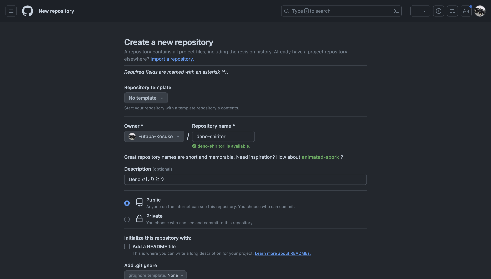


2. 以下のような画面になれば、リポジトリの完成です。任意の方法で、GitHubにソースコードをプッシュしてみましょう。CUIで操作する場合は、GitHubの画面に表示されているコマンドを実行すればOKです。

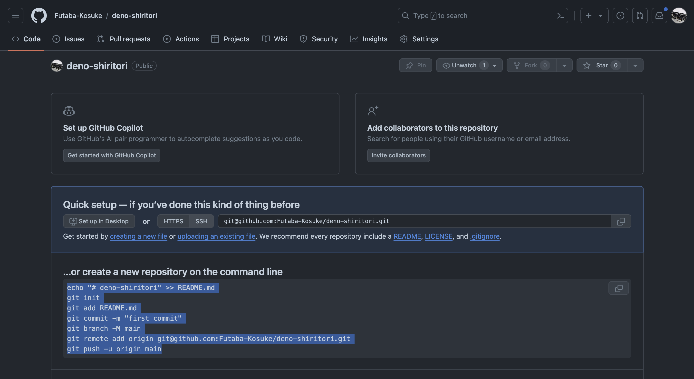


3. 以下の例では、`README.md`も一緒にプッシュしてみました。GitHubでは、`README.md`に記述した内容が画面下部に表示されます。ここに環境構築手順やリポジトリの説明等を記載すると分かりやすいです。

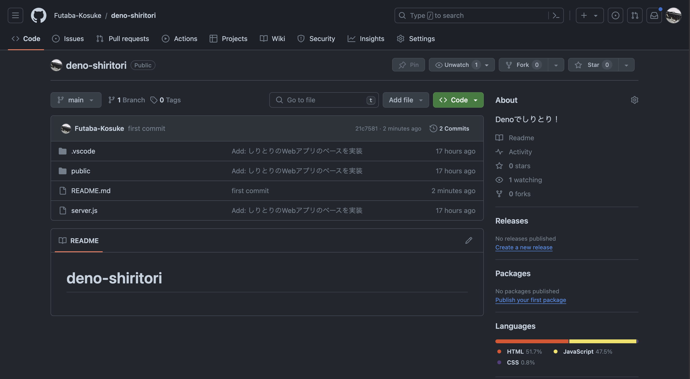

## Step 12. Deno Deployにデプロイしてみよう

> 注意
> GitHubアカウントの作成後、一週間程はDeno Deployの登録ができません。登録できない場合は、Step 12はスキップしてStep 13を先に終わらせてください。

### Deno Deployのアカウント登録をしよう

Deno Deployでアカウント登録しましょう。Deno DeployのアカウントはGitHubアカウントと連携する形で作成できるので、先に作成したGitHubアカウントを使用してください。

[https://deno.com/deploy](https://deno.com/deploy)


### Deno Deployのプロジェクトを作成しよう

早速、Deno Deployのプロジェクトを作ってみましょう。

GitHubのリポジトリを元に、Deno Deployのプロジェクトを作成します。

1. 「New Project」をクリックして、新規プロジェクトの作成画面を開きましょう。


2. 「Select User or Organization」から「Add Github Account」を選択します。

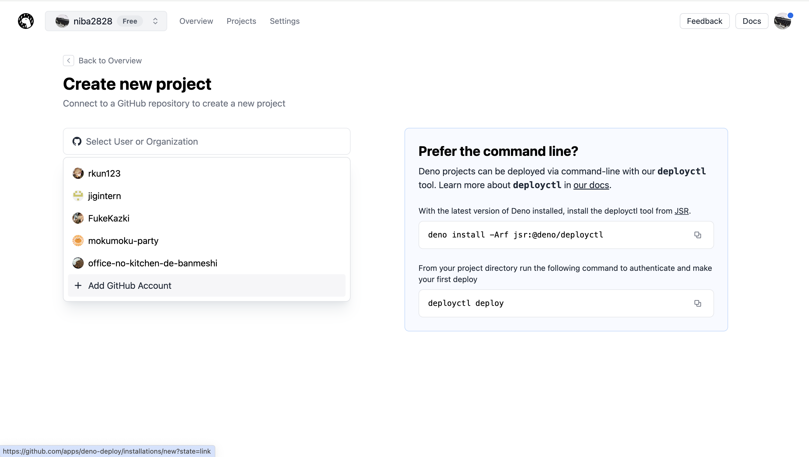

3. Deno Deployから全てのリポジトリへのアクセスを許可する場合は「All repositories」、一部のリポジトリにのみ絞りたい場合は「Only select repositories」を選択して、作成したWebアプリのリポジトリを指定しましょう。

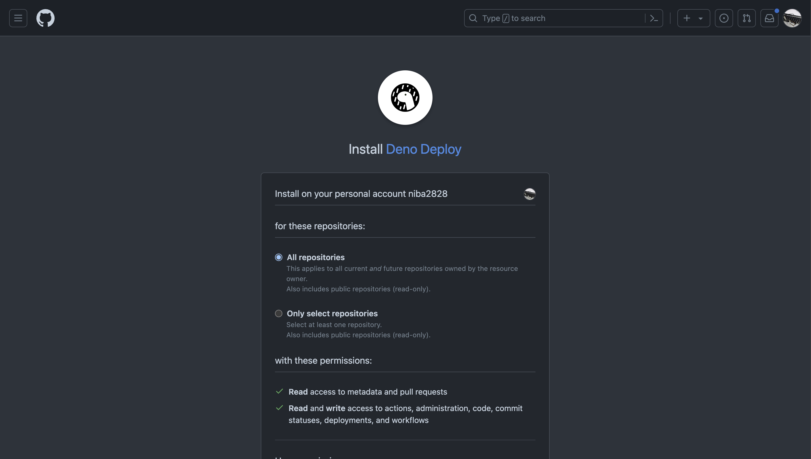

4. 以下のようにアカウント設定、リポジトリを指定し、「Entrypoint」には`server.js`を指定して、「Deploy Project」をクリックします。

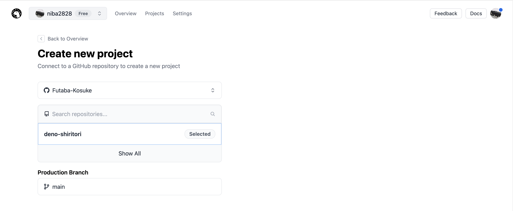
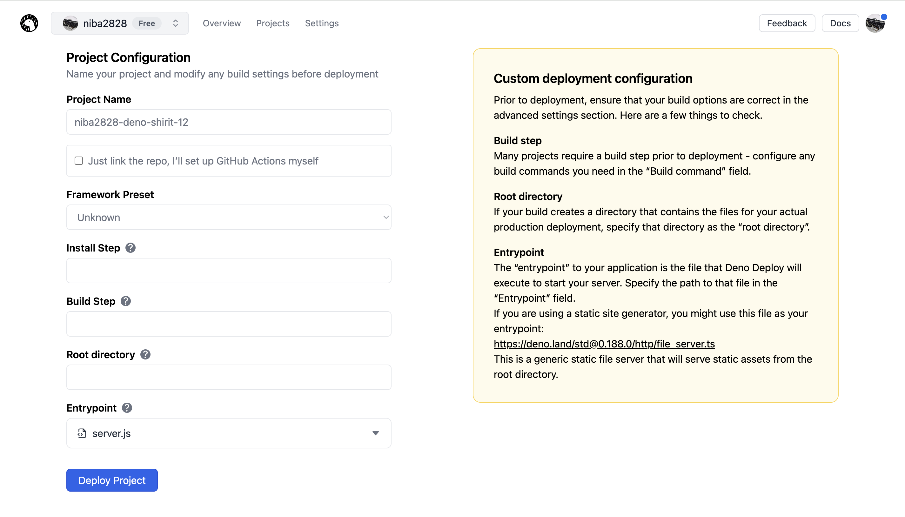

> Topic: Entrypointに指定したDenoファイルが、サーバー起動時に自動で実行されます。

5. しばらくするとデプロイが完了します。以下の画像の二枚目の画面になったら、完了です。表示されているリンクをクリックしてWebサイトを開いてみましょう！

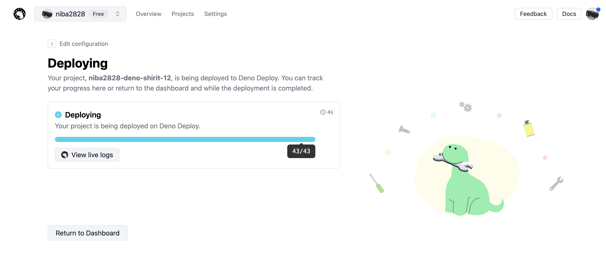
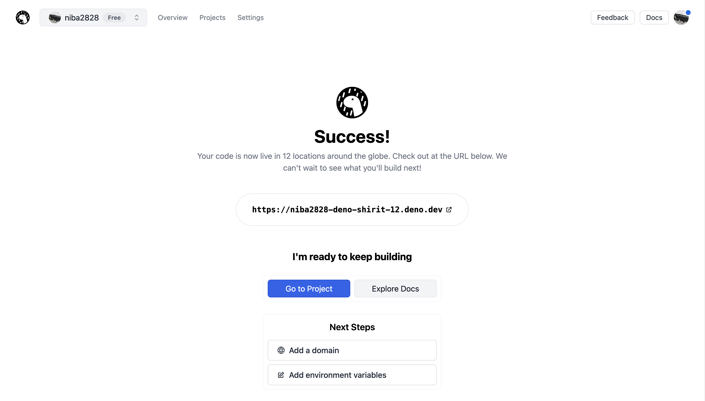
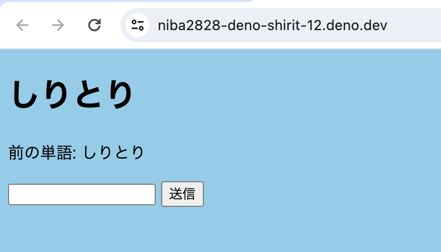

## Step13. おわりに

ここまでで、Deno DeployにWebアプリケーションをデプロイして動作させることができました。Deno DeployはGitHubと連携していますので、GitHubを更新すれば自動で修正された内容がデプロイされるようになっています。

このまま実装を進めて、課題として示されたアプリケーションの仕様を満たしたものを実装してみましょう。  
以降はご自身で実装を進めていただきますが、次セクションに実装のヒントを記載していますので、参考にしても構いません。

必須仕様を満たした上で、便利・面白いと思う任意の機能を実装したら完成です。
アプリケーションが完成したら、`README`を記載して、Google フォームから提出してください。

## Step 14. 実装のヒント

ここでは、必須仕様を満たすための実装のヒントを掲載します。

### 実装の例

以下のWebサイトに必須仕様を満たすWebアプリケーションをデプロイしました。実装の参考にしてみてください。
尚、課題に記載していなかった詳細な仕様については自身で検討して実装していますが、以下に示すのはあくまでも一例ですので、従う必要はありません。

[https://niba2828-deno-shirit-12.deno.dev/](https://niba2828-deno-shirit-12.deno.dev/)  

### "末尾が「ん」で終わる単語が入力されたら、ゲームを終了する"

#### Hint1: 処理を追加する場所

`POST /shiritori`を実行した際の処理を修正して、以下の部分に処理を追加するとよさそうです。

```diff
// server.js
  ...
          // previousWordの末尾とnextWordの先頭が同一か確認
          if (previousWord.slice(-1) === nextWord.slice(0, 1)) {
+             // 末尾が「ん」になっている場合
+             // ifの中に入力された単語の末尾が「ん」になっていることを確認する条件式を追加
+             if (...) {
+                 // エラーを返す処理を追加
+                 // errorCodeを固有のものにして、末尾が「ん」の時に発生したエラーだとWeb側に通知できるようにする
+             }
+ 
              // 同一であれば、previousWordを更新
              previousWord = nextWord;
          }
  ...
```

```diff
// index.html
  ...
        if (response.status !== 200) {
          const errorJson = await response.text();
          const errorObj = JSON.parse(errorJson);
+         // errorObj["errorCode"]ごとに処理を分岐する
+         // errorCodeが、末尾が「ん」の時のエラーだったら、ゲームを終了する
          return;
        }
  ...
```

#### Hint2: ゲーム終了時のWeb画面表示

ゲームの終了時には、ゲームが終了したことを画面に表示するとよさそうです。

ゲームの終了を画面に表示する方法として、以下のものが考えられます。

1. 表示文言を修正して、入力フォームを削除する。
2. 終了用の画面に遷移する。

1の場合は、HTMLタグの操作や削除など、ここまでに実装した内容の応用で実装が可能です。  
2の場合は、HTMLファイルを新しく作成し、ゲーム終了時にゲーム終了画面に遷移するようにすれば実装可能です。

### "過去に使用した単語が入力されたら、ゲームを終了する"

#### Hint1: 処理を追加する場所

処理を追加する場所は、末尾が「ん」の場合の処理と殆ど変わりません。新しいエラーの処理を実装しましょう。
また、直前より前の単語を保存しておく必要がありますので、その点の処理を追記しましょう。

#### Hint2: 直前より前の単語を保存する

今までは、直前の単語のみを保存して入力した単語と比較していました。しかし、入力した単語が既に使われているかを確認するには、今までの単語を全て記録しておく必要があります。

そこで、JavaScriptのリストを使用して今までの単語を保存しておきましょう。以下のようにして、単語の保存用の変数をリストにしておき、**単語の更新時に逐次保存する**ようにしておけばよさそうです。

```diff
- let previousWord = "しりとり";
+ let wordHistories = ["しりとり"];
```

また、もし余裕があれば、新しくサーバーを作ったりSaaSを使ったりして、データベース等を使用してみるのも良いかもしれません。

### "ゲーム中や終了後に、最初からやり直せるリセット機能をつける"

#### Hint1: 処理を追加する場所

サーバーに、`POST /reset`等の新しい`POST`メソッドを追加しましょう。また、追加した`POST`メソッドを実行するためのボタンをWebに追加しましょう。

```diff
// server.js
  ...
          return new Response(previousWord);
      }

+     // POST /reset: リセットする
+     // request.methodとpathnameを確認
+     if (...) {
+         // 既存の単語の履歴を初期化する
+         // 初期化した単語を返す
+     }
+ 
      // ./public以下のファイルを公開
      return serveDir(
          request,
  ...
```

```diff
// index.html
  ...
    <!-- 次の文字を入力するフォーム -->
    <input id="nextWordInput" type="text" />
    <button id="nextWordSendButton">送信</button>
+   <button id="resetSendButton">リセット</button>
  ...
        // inputタグの中身を消去する
        nextWordInput.value = "";
      }

+     // 送信ボタンの押下時に実行
+     document.querySelector("#resetSendButton").onclick = async(event) => {
+       // POST /resetを実行
+       // ページをリロードする
+     }
    </script>
  ...
```

#### Hint2: ページをリロードする

リセット処理後、必要であればページをリロードして、Webサイトの表示をリセットしましょう。ゲーム終了時に要素を削除していた場合は、リロードの処理が必要になるかと思います。

JavaScriptの関数を検索して、処理を追記してみましょう。